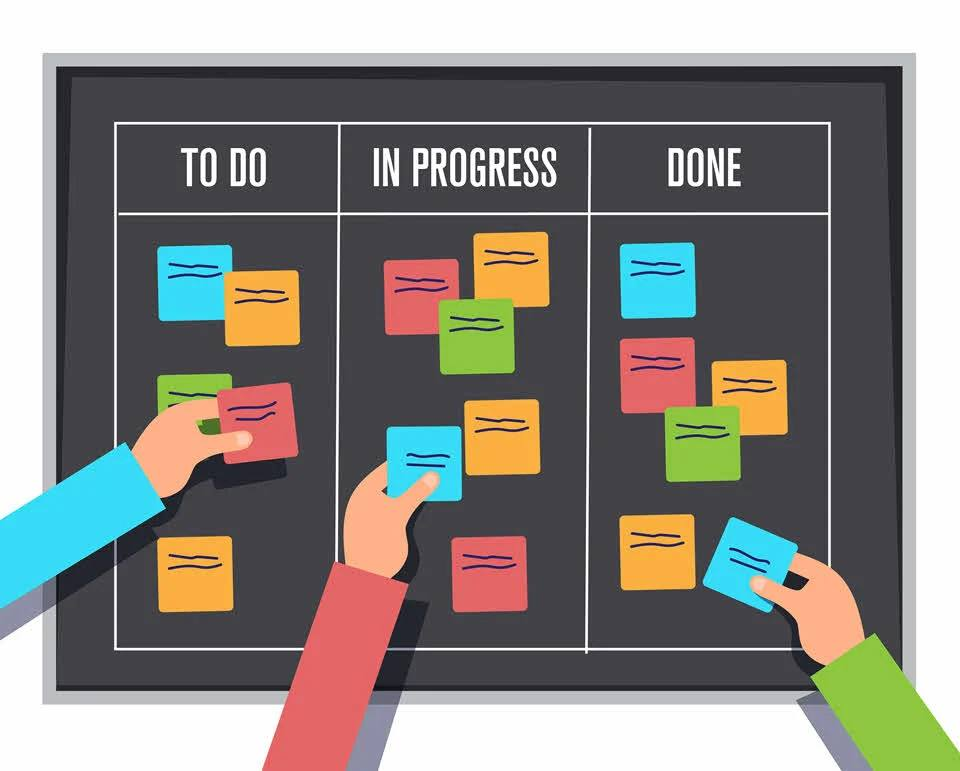
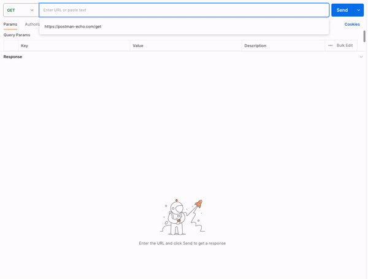

<a name="readme-top"></a>

<!-- PROJECT SHIELDS -->
<div align="center">
  
  
  
  
</div>

<!-- PROJECT LOGO -->
<br />
<div align="center">
  <a href=" ">
    
  </a>
  <h1 align="center">Task management system</h1>
</div>


<!-- TABLE OF CONTENTS -->
<details>
  <summary>Table of Contents</summary>
  <ol>
    <li>
      <a href="#about-the-project">About The Project</a>
      <ul>
        <li><a href="#built-with">Built With</a></li>
      </ul>
    </li>
    <li>
      <a href="#getting-started">Getting Started</a>
      <ul>
        <li><a href="#prerequisites">Prerequisites</a></li>
        <li><a href="#installation">Installation</a></li>
      </ul>
    </li>
    <li><a href="#usage">Usage</a></li>
    <li><a href="#contact">Contact</a></li>
</details>


<!-- ABOUT THE PROJECT -->
## About The Project

  Welcome to the Task Management System! This project is designed to offer a robust solution for efficient task management, providing a seamless experience for organizing and tracking tasks within a collaborative environment.
  
<p align="right">(<a href="#readme-top">back to top</a>)</p>


### Built With
* 
* 
* 
* 
* 
* 
* 

<p align="right">(<a href="#readme-top">back to top</a>)</p>

<!-- GETTING STARTED -->
## Getting Started

### Prerequisites
Before you begin, ensure you have the following prerequisites installed on your system:

**Java Development Kit (JDK):** The application is built with Java, so make sure you have the latest JDK installed. 

**MySQL Database:** The system utilizes MySQL to store data. Install MySQL and set up a database for the application.

### Installation

Setting up the Task Management System is a straightforward process. Follow these steps to get your local copy up and running:

1. Clone the repo:
   ```sh
   git clone https://github.com/DrDmlg/task-management-system.git
   ```
2. Open the project in the development environment.

3. Configure Database:
   Create a new database in MySQL. Specify the properties in the application.properties file
   
4. Run the application!

**The endpoints description is available at http://localhost:8080/swagger-ui.html You can test it using Postman or cURL**

Congratulations! You've successfully installed the Task Management System. Feel free to explore its features and start managing your tasks efficiently. If you encounter any issues during the installation process, refer to the project's documentation or seek assistance from the community.

<p align="right">(<a href="#readme-top">back to top</a>)</p>


<!-- USAGE EXAMPLES -->
## Usage

Demonstration of a request to the endpoint to retrieve information about a task by its identifier.

<p align="center"> </p>

<p align="center"> </p>

<p align="center"> </p>
<hr>

<p align="right">(<a href="#readme-top">back to top</a>)</p>


<!-- CONTACT -->
## Contact

D. Dmitry - [Linkedin](https://www.linkedin.com/in/dmitry-dorokhov/) - dorokhov.did@gmail.com

Project Link: [https://github.com/DrDmlg/task-management-system](https://github.com/DrDmlg/task-management-system)

<p align="right">(<a href="#readme-top">back to top</a>)</p>
